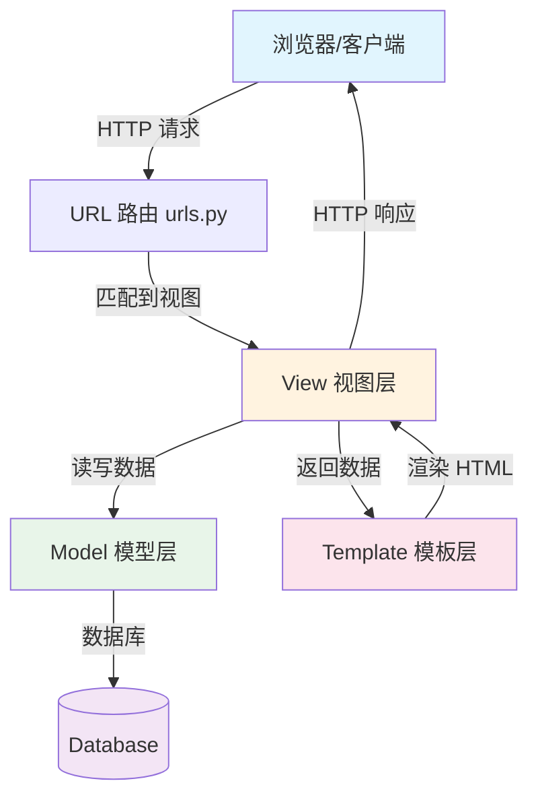
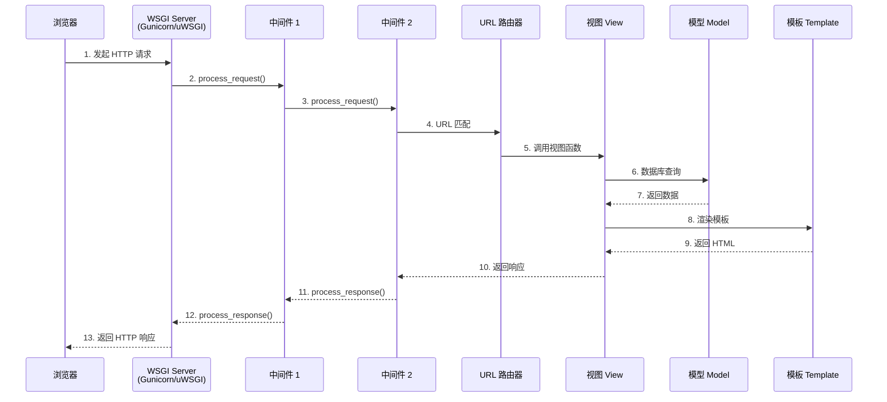
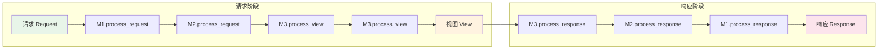
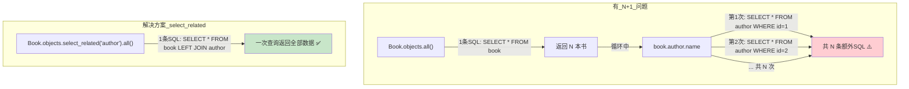
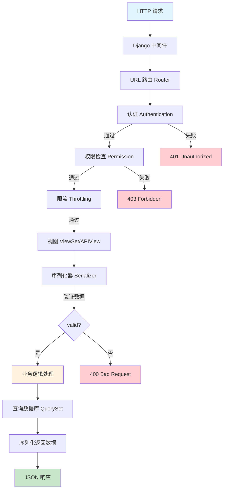
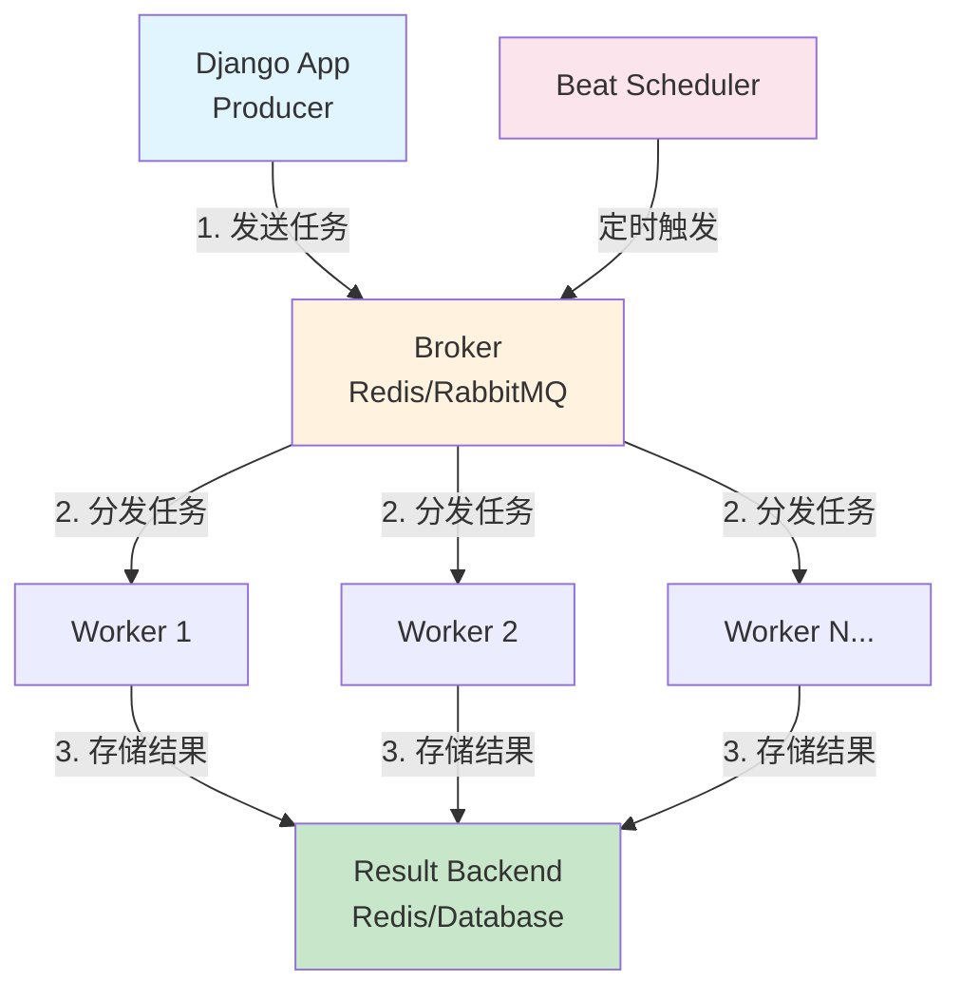

# Django 面试题整理（综合版）

> 整理时间：2026-04-29 | 来源：知乎、CSDN、Stack Overflow、官方文档等

---

## 目录

1. [Django 基础](#1-django-基础)
2. [ORM 数据库](#2-orm-数据库)
3. [视图与模板](#3-视图与模板)
4. [中间件与信号](#4-中间件与信号)
5. [REST Framework](#5-rest-framework)
6. [Celery 异步任务](#6-celery-异步任务)
7. [缓存与性能优化](#7-缓存与性能优化)
8. [安全](#8-安全)
9. [进阶与源码](#9-进阶与源码)

---

## 1. Django 基础

### Q1: Django 的 MTV 架构是什么？和 MVC 有什么区别？

**MTV 架构流程图：**



Django 采用 MTV（Model-Template-View）模式：

- **Model（模型）**：负责数据层，处理数据库交互、数据验证
- **Template（模板）**：负责表现层，定义 HTML 展示逻辑
- **View（视图）**：负责业务逻辑层，接收请求、处理数据、返回响应

与 MVC 的对应关系：
- Django 的 Model ≈ MVC 的 Model
- Django 的 Template ≈ MVC 的 View
- Django 的 View ≈ MVC 的 Controller

### Q2: Django 的请求生命周期是怎样的？



1. 用户发起 HTTP 请求
2. WSGI 服务器（如 Gunicorn/uWSGI）接收请求
3. 经过 Django 中间件链的 `process_request`
4. URL 路由匹配到对应的视图函数
5. 视图处理业务逻辑，与 Model、Template 交互
6. 经过中间件链的 `process_response`
7. 返回 HTTP 响应给客户端

### Q3: Django 中的中间件是什么？执行顺序是怎样的？

中间件是 Django 的请求/响应处理钩子框架，用于全局修改请求或响应。

**中间件执行流程：**



执行顺序：请求从 MIDDLEWARE[0] 到 MIDDLEWARE[n] 依次处理，进入视图；响应则从 MIDDLEWARE[n] 到 MIDDLEWARE[0] 反向返回（洋葱模型）。

每个中间件可以定义的方法：
- `process_request(request)` — 请求阶段
- `process_view(request, view_func, view_args, view_kwargs)` — 视图调用前
- `process_exception(request, exception)` — 视图抛出异常时
- `process_template_response(request, response)` — 模板渲染后
- `process_response(request, response)` — 响应阶段

### Q4: Django 项目目录结构中各文件的作用？

```mermind
project/
├── manage.py          # 项目管理入口，命令行工具
├── project/
│   ├── __init__.py
│   ├── settings.py    # 全局配置
│   ├── urls.py        # 根 URL 路由
│   ├── asgi.py        # ASGI 配置
│   └── wsgi.py        # WSGI 配置
└── app/
    ├── migrations/    # 数据库迁移文件
    ├── models.py      # 数据模型
    ├── views.py       # 视图
    ├── urls.py        # 应用级路由
    ├── admin.py       # 后台管理
    ├── tests.py       # 测试
    └── apps.py        # 应用配置
```

### Q5: Django 中 `settings.py` 的常用配置有哪些？

```python
DEBUG = True                      # 调试模式
ALLOWED_HOSTS = ['*']             # 允许访问的主机
INSTALLED_APPS = [...]            # 已安装的应用
MIDDLEWARE = [...]                # 中间件列表
DATABASES = {...}                 # 数据库配置
STATIC_URL = '/static/'           # 静态文件 URL
STATIC_ROOT = BASE_DIR / 'static' # 静态文件收集目录
MEDIA_URL = '/media/'             # 媒体文件 URL
SECRET_KEY = '...'                # 密钥（生产环境务必保密）
```

### Q6: `ForeignKey` 的 `on_delete` 参数有哪些选项？

| 选项 | 说明 |
|---|---|
| `CASCADE` | 级联删除，删除主表记录时同时删除关联记录 |
| `PROTECT` | 阻止删除，抛出 `ProtectedError` |
| `SET_NULL` | 设置为 NULL（需要 `null=True`） |
| `SET_DEFAULT` | 设置为默认值（需要 `default` 参数） |
| `SET()` | 设置为指定值或函数返回值 |
| `DO_NOTHING` | 什么都不做（需自行保证数据完整性） |

### Q7: `class Meta` 在 Django Model 中的作用？

`class Meta` 定义模型的元数据，常用选项：

```python
class Book(models.Model):
    title = models.CharField(max_length=200)

    class Meta:
        db_table = 'book'              # 自定义表名
        ordering = ['-created_at']     # 默认排序
        verbose_name = '图书'           # 可读名称
        unique_together = ['title', 'author']  # 联合唯一约束
        indexes = [models.Index(fields=['title'])]  # 索引
        permissions = [("can_publish", "Can publish book")]  # 权限
```

### Q8: Django 中如何自定义用户模型？

```python
from django.contrib.auth.models import AbstractUser

class User(AbstractUser):
    phone = models.CharField(max_length=11, unique=True)
    avatar = models.ImageField(upload_to='avatars/')

# settings.py
AUTH_USER_MODEL = 'myapp.User'
```

**注意**：必须在第一次迁移前设置 `AUTH_USER_MODEL`，否则会很麻烦。

---

## 2. ORM 数据库

### Q9: Django ORM 中 `select_related` 和 `prefetch_related` 的区别？

| | `select_related` | `prefetch_related` |
|---|---|---|
| SQL 方式 | JOIN 查询（一条 SQL） | 额外查询 + Python 拼接 |
| 适用关系 | ForeignKey / OneToOne | ManyToMany / 反向 ForeignKey |
| 性能 | 减少 SQL 次数，但 JOIN 可能很大 | 两条 SQL，Python 层关联 |

**N+1 问题与解决对比：**



```python
# select_related：一条 SQL LEFT JOIN
books = Book.objects.select_related('author').all()

# prefetch_related：两条 SQL，Python 拼接
books = Book.objects.prefetch_related('tags').all()
```

### Q10: Django 中 `Q` 对象和 `F` 对象的作用？

**Q 对象**：构建复杂查询条件（OR、NOT）

```python
from django.db.models import Q
# 查询标题含"Django"或作者名为"张三"的书
Book.objects.filter(Q(title__icontains='Django') | Q(author__name='张三'))
# 非操作
Book.objects.filter(~Q(status='draft'))
```

**F 对象**：引用模型字段的值，避免竞争条件

```python
from django.db.models import F
# 原子更新：点赞数 +1
Article.objects.filter(id=1).update(likes=F('likes') + 1)
```

### Q11: Django 事务怎么用？

```python
from django.db import transaction

# 方式一：装饰器
@transaction.atomic
def transfer(from_account, to_account, amount):
    from_account.balance -= amount
    from_account.save()
    to_account.balance += amount
    to_account.save()

# 方式二：上下文管理器
with transaction.atomic():
    # 事务内的操作
    pass

# 方式三：手动控制（非 atomic 块内）  
# 设置保存点
sid = transaction.savepoint()
# 回滚到保存点
transaction.savepoint_rollback(sid)
```

### Q12: Django 中如何执行原生 SQL？

```python
from django.db import connection

# 查询
with connection.cursor() as cursor:
    cursor.execute("SELECT * FROM book WHERE id = %s", [book_id])
    rows = cursor.fetchall()

# 或者使用 raw()
books = Book.objects.raw('SELECT * FROM book WHERE price > %s', [100])
```

### Q13: 什么是 N+1 查询问题？如何解决？

N+1 问题：查询 N 个对象时，每个对象又触发一次额外查询。

```python
# ❌ N+1 问题
books = Book.objects.all()           # 1 条 SQL
for book in books:
    print(book.author.name)          # N 条 SQL

# ✅ 解决
books = Book.objects.select_related('author').all()  # 1 条 SQL
```

使用 `django-debug-toolbar` 或 `django-silk` 检测 N+1 问题。

### Q14: Django 模型继承有哪几种方式？

| 方式 | 说明 | DB 表 |
|---|---|---|
| 抽象基类 | `class Meta: abstract = True` | 不创建表，子类各自建表 |
| 多表继承 | 父类非抽象 | 父类和子类各一张表，OneToOne 关联 |
| 代理模型 | `class Meta: proxy = True` | 不创建新表，改变行为 |

```python
# 抽象基类
class BaseModel(models.Model):
    created_at = models.DateTimeField(auto_now_add=True)
    class Meta:
        abstract = True

# 代理模型  
class PublishedBook(Book):
    class Meta:
        proxy = True
        ordering = ['-published_at']
```

### Q15: `only()` 和 `defer()` 的区别？

- `only()`：只加载指定字段
- `defer()`：延迟加载指定字段（其他字段立即加载）

```python
# 只查询 title 和 author_id
Book.objects.only('title', 'author_id').all()

# 不加载 content 字段（可能是大文本）
Book.objects.defer('content').all()
```

---

## 3. 视图与模板

### Q16: FBV 和 CBV 的区别？各有什么优缺点？

| | FBV（函数视图） | CBV（类视图） |
|---|---|---|
| 定义 | 函数 | 类 |
| 代码量 | 简单逻辑更少 | 复杂逻辑更少 |
| 复用 | 装饰器 | 继承/Mixin |
| 灵活性 | 高 | 中等 |
| 适用 | 简单页面 | CRUD 接口 |

```python
# FBV
def book_list(request):
    books = Book.objects.all()
    return render(request, 'book_list.html', {'books': books})

# CBV
class BookListView(ListView):
    model = Book
    template_name = 'book_list.html'
```

### Q17: Django 常用的通用类视图有哪些？

| 视图类 | 用途 |
|---|---|
| `TemplateView` | 渲染模板 |
| `ListView` | 对象列表 |
| `DetailView` | 单个对象详情 |
| `CreateView` | 创建对象 |
| `UpdateView` | 更新对象 |
| `DeleteView` | 删除对象 |
| `FormView` | 处理表单 |
| `RedirectView` | 重定向 |

### Q18: Django 模板中常用标签和过滤器有哪些？

**过滤器：**
```
{{ value|length }}         # 长度
{{ value|date:"Y-m-d" }}   # 日期格式化
{{ value|default:"N/A" }}  # 默认值
{{ value|truncatechars:10 }} # 截断
{{ value|safe }}           # 不转义 HTML
```

**标签：**
```
...
...
...




```

### Q19: Django 模板中如何自定义过滤器？

```python
# app/templatetags/my_filters.py
from django import template
register = template.Library()

@register.filter
def multiply(value, arg):
    return value * arg

# 模板中使用

{{ price|multiply:quantity }}
```

### Q20: Django 的上下文处理器是什么？

上下文处理器是一个函数，接收 `request` 参数，返回一个字典，该字典会合并到所有模板的上下文中。

```python
# settings.py
TEMPLATES = [
    {
        'OPTIONS': {
            'context_processors': [
                'django.template.context_processors.debug',
                'django.template.context_processors.request',
                'django.contrib.auth.context_processors.auth',
            ],
        },
    },
]
```

---

## 4. 中间件与信号

### Q21: 如何自定义 Django 中间件？

```python
class SimpleMiddleware:
    def __init__(self, get_response):
        self.get_response = get_response

    def __call__(self, request):
        # 请求前处理
        print('请求进入')
        response = self.get_response(request)
        # 响应后处理
        print('响应返回')
        return response
```

### Q22: Django 信号是什么？常用信号有哪些？

信号是一种观察者模式的实现，允许解耦的应用在特定事件发生时得到通知。

常用信号：
- `pre_save` / `post_save` — 模型保存前/后
- `pre_delete` / `post_delete` — 模型删除前/后
- `m2m_changed` — 多对多关系变化
- `request_started` / `request_finished` — 请求开始/结束
- `user_logged_in` / `user_logged_out` — 用户登录/登出

### Q23: Django 信号的使用方式？

```python
from django.db.models.signals import post_save
from django.dispatch import receiver

@receiver(post_save, sender=User)
def create_user_profile(sender, instance, created, **kwargs):
    if created:
        Profile.objects.create(user=instance)

# 或者手动注册
post_save.connect(create_user_profile, sender=User)
```

### Q24: Django 中间件和信号的使用场景对比？

| | 中间件 | 信号 |
|---|---|---|
| 粒度 | 请求/响应级别 | 模型/应用级别 |
| 适用 | 认证、日志、CORS | 缓存失效、搜索索引更新 |
| 耦合度 | 较低 | 极低 |
| 执行方式 | 同步链式 | 同步（默认） |

---

## 5. REST Framework

### Q25: DRF 中的序列化器（Serializer）和模型序列化器（ModelSerializer）的区别？

**DRF 请求处理流程：**



**Serializer**：手动定义所有字段，灵活度高。
**ModelSerializer**：基于 Django Model 自动生成字段，减少样板代码。

```python
# Serializer
class BookSerializer(serializers.Serializer):
    id = serializers.IntegerField(read_only=True)
    title = serializers.CharField(max_length=200)

# ModelSerializer
class BookSerializer(serializers.ModelSerializer):
    class Meta:
        model = Book
        fields = '__all__'
        # 或
        fields = ['id', 'title', 'author']
        exclude = ['secret_field']
```

### Q26: DRF 中 APIView 和 ViewSet 的区别？

| | APIView | ViewSet |
|---|---|---|
| 路由定义 | 手动配置 URL | Router 自动生成 |
| 代码量 | 每个视图单独写 | 一套 CRUD 统一处理 |
| 灵活性 | 高 | 中等 |
| 适用 | 自定义端点 | 标准 RESTful 接口 |

```python
# APIView
class BookList(APIView):
    def get(self, request):
        ...

# ViewSet
class BookViewSet(viewsets.ModelViewSet):
    queryset = Book.objects.all()
    serializer_class = BookSerializer
```

### Q27: DRF 的认证方式有哪些？

DRF 提供的内置认证类：
- `BasicAuthentication` — HTTP 基本认证
- `TokenAuthentication` — Token 认证
- `SessionAuthentication` — Session 认证
- `JWTAuthentication`（djangorestframework-simplejwt）— JWT 认证

```python
# 全局配置
REST_FRAMEWORK = {
    'DEFAULT_AUTHENTICATION_CLASSES': [
        'rest_framework_simplejwt.authentication.JWTAuthentication',
    ],
}
```

### Q28: DRF 的权限控制怎么做？

```python
from rest_framework import permissions

# 全局配置
REST_FRAMEWORK = {
    'DEFAULT_PERMISSION_CLASSES': [
        'rest_framework.permissions.IsAuthenticated',
    ],
}

# 视图级
class BookViewSet(viewsets.ModelViewSet):
    permission_classes = [permissions.IsAuthenticatedOrReadOnly]

# 自定义权限
class IsOwnerOrReadOnly(permissions.BasePermission):
    def has_object_permission(self, request, view, obj):
        return obj.owner == request.user
```

### Q29: DRF 分页有哪几种？

| 分页类 | 说明 |
|---|---|
| `PageNumberPagination` | 基于页码，`?page=2&size=10` |
| `LimitOffsetPagination` | 基于偏移量，`?limit=10&offset=20` |
| `CursorPagination` | 基于游标，适合大数据量实时数据 |

### Q30: DRF 中如何优化性能？

- 使用 `select_related` / `prefetch_related` 减少查询
- 重写 `get_queryset` 方法添加优化
- 使用 `SerializerMethodField` 时注意 N+1
- 考虑使用 `django-restql` 或 GraphQL 减少数据量

---

## 6. Celery 异步任务

### Q31: Celery 的核心组件有哪些？

- **Producer**：产生任务的应用
- **Broker**：消息中间件（RabbitMQ / Redis）
- **Worker**：执行任务的进程
- **Result Backend**：存储任务结果（Redis / Database）

**Celery 架构流程图：**



### Q32: Django 中如何集成 Celery？

```python
# celery.py
import os
from celery import Celery

os.environ.setdefault('DJANGO_SETTINGS_MODULE', 'project.settings')
app = Celery('project')
app.config_from_object('django.conf:settings', namespace='CELERY')
app.autodiscover_tasks()
```

### Q33: Celery 任务如何定义和调用？

```python
# tasks.py
from celery import shared_task

@shared_task
def send_email_task(user_id):
    user = User.objects.get(id=user_id)
    # 发送邮件逻辑
    return True

# 调用
send_email_task.delay(user_id)  # 异步
send_email_task.apply_async((user_id,), countdown=10)  # 延迟 10 秒
result = send_email_task.apply((user_id,))  # 同步（调试用）
```

### Q34: Celery 定时任务怎么做？

```python
# celery.py
from celery.schedules import crontab

app.conf.beat_schedule = {
    'clean-expired-sessions': {
        'task': 'myapp.tasks.clean_expired_sessions',
        'schedule': crontab(hour=3, minute=0),  # 每天凌晨 3 点
    },
}
```

### Q35: Celery Worker 的并发模型有哪些？

| 并发模型 | 适用场景 |
|---|---|
| `prefork`（默认） | CPU 密集型，多进程 |
| `threads` | IO 密集型（注意 GIL） |
| `eventlet/gevent` | 高 IO 并发 |
| `solo` | 调试 |

```bash
celery -A project worker --concurrency=4 --pool=gevent
```

---

## 7. 缓存与性能优化

### Q36: Django 支持哪些缓存后端？

| 后端 | 说明 |
|---|---|
| `MemcachedCache` | 基于内存，高性能 |
| `RedisCache` | 功能丰富，支持持久化 |
| `DatabaseCache` | 存数据库 |
| `FileBasedCache` | 存文件系统 |
| `LocMemCache` | 进程内内存（默认，开发用） |
| `DummyCache` | 不缓存（测试用） |

```python
CACHES = {
    'default': {
        'BACKEND': 'django.core.cache.backends.redis.RedisCache',
        'LOCATION': 'redis://127.0.0.1:6379/1',
    }
}
```

### Q37: Django 缓存的使用方式？

```python
from django.core.cache import cache

# 设置缓存
cache.set('key', 'value', timeout=60)
# 获取（无则返回 None）
cache.get('key')
# 获取或设置
cache.get_or_set('key', 'default', timeout=60)
# 删除
cache.delete('key')

# 视图缓存装饰器
from django.views.decorators.cache import cache_page
@cache_page(60 * 15)  # 缓存 15 分钟
def my_view(request):
    ...

# 模板片段缓存


    <!-- 缓存 500 秒 -->

```

### Q38: Django 数据库查询优化有哪些手段？

1. 使用 `select_related` / `prefetch_related`
2. 使用 `only()` / `defer()` 只加载需要的字段
3. 使用 `values()` / `values_list()` 返回字典而非 Model 实例
4. 使用 `bulk_create` / `bulk_update` 批量操作
5. 使用 `exists()` 代替 `count()` 检查记录是否存在
6. 添加数据库索引
7. 使用数据库连接池（django-db-connection-pool）

### Q39: Django 中如何做数据库读写分离？

```python
DATABASES = {
    'default': {
        'ENGINE': 'django.db.backends.mysql',
        'NAME': 'write_db',
        'HOST': '主库地址',
    },
    'replica': {
        'ENGINE': 'django.db.backends.mysql',
        'NAME': 'read_db',
        'HOST': '从库地址',
    },
}

DATABASE_ROUTERS = ['path.to.ReadWriteRouter']

class ReadWriteRouter:
    def db_for_read(self, model, **hints):
        return 'replica'

    def db_for_write(self, model, **hints):
        return 'default'
```

---

## 8. 安全

### Q40: Django 默认提供哪些安全保护？

| 保护机制 | 说明 |
|---|---|
| CSRF 保护 | 跨站请求伪造防护，表单中需 `` |
| XSS 防护 | 模板自动转义 HTML，`safe` 过滤器显式标记 |
| SQL 注入防护 | ORM 使用参数化查询 |
| 点击劫持防护 | `X-Frame-Options: DENY` |
| 安全的 Session | Session 数据存服务端，Cookie 只存 sessionid |
| 密码哈希 | 默认使用 PBKDF2 + SHA256 |

### Q41: Django 项目的安全加固建议有哪些？

```python
# 生产环境 settings.py
DEBUG = False
ALLOWED_HOSTS = ['your-domain.com']
SECRET_KEY = os.environ['DJANGO_SECRET_KEY']  # 环境变量

# HTTPS 强制
SECURE_SSL_REDIRECT = True
SESSION_COOKIE_SECURE = True
CSRF_COOKIE_SECURE = True

# HSTS
SECURE_HSTS_SECONDS = 31536000
SECURE_HSTS_INCLUDE_SUBDOMAINS = True
```

### Q42: 文件上传安全注意事项？

- 验证文件类型（白名单，不依赖扩展名）
- 限制文件大小
- 使用 `django-storages` 存到云存储（非本地）
- 不在用户可访问的目录执行上传文件

```python
def validate_file_extension(value):
    ext = os.path.splitext(value.name)[1]
    if ext.lower() not in ['.jpg', '.png', '.pdf']:
        raise ValidationError('不支持的文件类型')
```

---

## 9. 进阶与源码

### Q43: Django 信号是同步的还是异步的？

默认是**同步**的。信号接收器会在发送信号的同一线程中执行，会阻塞当前请求。如需异步，需要结合 Celery 等任务队列。

### Q44: Django 的 `Manager` 是什么？

Manager 是 Django 模型与数据库交互的接口。每个模型至少有一个默认 Manager（`objects`）。可自定义：

```python
class PublishedManager(models.Manager):
    def get_queryset(self):
        return super().get_queryset().filter(status='published')

class Book(models.Model):
    objects = models.Manager()  # 默认
    published = PublishedManager()  # 自定义
```

### Q45: `migrate` 和 `makemigrations` 的区别？

| 命令 | 作用 |
|---|---|
| `makemigrations` | 基于 Model 变更**生成**迁移文件 |
| `migrate` | 将迁移文件**应用**到数据库 |

### Q46: Django 如何处理数据库连接？

Django 默认使用持久连接（`CONN_MAX_AGE` 控制）。请求开始时从连接池获取连接，结束时归还。`CONN_MAX_AGE=0` 表示每次请求新建连接。

### Q47: Django Admin 如何自定义？

```python
@admin.register(Book)
class BookAdmin(admin.ModelAdmin):
    list_display = ['title', 'author', 'created_at']  # 列表页显示字段
    list_filter = ['status', 'created_at']  # 过滤
    search_fields = ['title', 'author__name']  # 搜索
    ordering = ['-created_at']
    actions = ['make_published']  # 批量操作

    def make_published(self, request, queryset):
        queryset.update(status='published')
```

### Q48: Django 如何生成和校验 JWT Token？

通常使用 `djangorestframework-simplejwt`：

```python
from rest_framework_simplejwt.tokens import RefreshToken

# 生成
def get_tokens_for_user(user):
    refresh = RefreshToken.for_user(user)
    return {
        'refresh': str(refresh),
        'access': str(refresh.access_token),
    }

# 视图
from rest_framework_simplejwt.views import TokenObtainPairView, TokenRefreshView
```

### Q49: Django 中 `queryset` 是惰性的吗？

是的。QuerySet 是惰性求值的，在以下情况才会真正执行 SQL：
- 迭代（`for obj in queryset`）
- 切片（`queryset[:10]`）
- `len()` / `list()` / `bool()`
- `repr()` 在交互式中

### Q50: Django URL 路由命名空间有什么用？

防止不同 app 的 URL 名称冲突，并支持重用：

```python
# project/urls.py
path('blog/', include(('blog.urls', 'blog'), namespace='blog'))

# 模板中

# 视图中
reverse('blog:post_detail', args=[post.id])
```

---

> **整理说明**：以上问题来源于知乎、CSDN、Stack Overflow、Django 官方文档等多个渠道的高频面试题。建议配合 [Django 官方文档](https://docs.djangoproject.com/) 和 [DRF 文档](https://www.django-rest-framework.org/) 进行深入复习。
