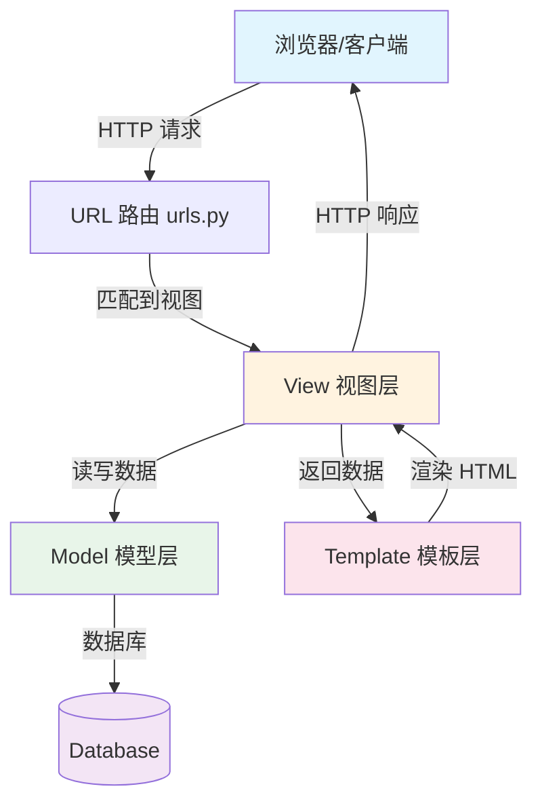
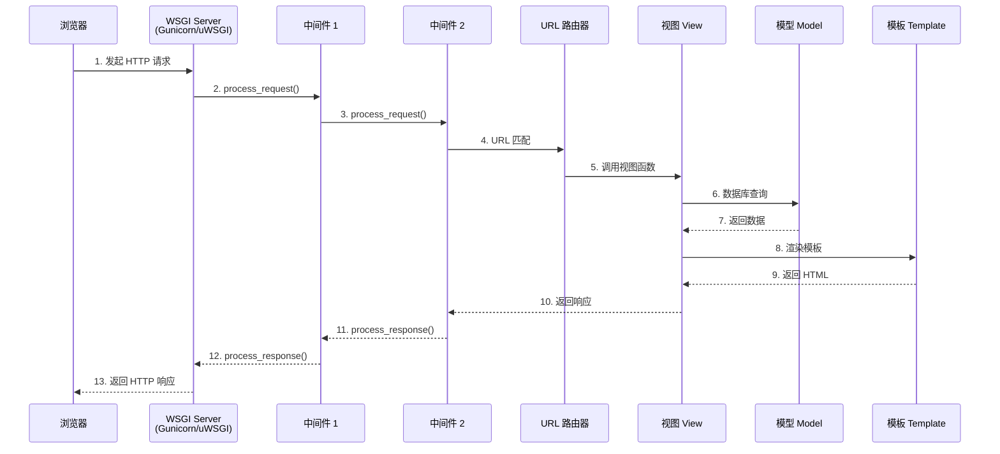
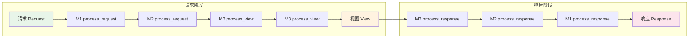

# Django 基础

>整理时间：2026-04-29 | 来源：知乎、CSDN、Stack Overflow、官方文档等

---

## 目录

1. [MTV 架构](#q1-django-的-mtv-架构是什么和-mvc-有什么区别)
2. [请求生命周期](#q2-django-的请求生命周期是怎样的)
3. [中间件](#q3-django-中的中间件是什么执行顺序是怎样的)
4. [项目目录结构](#q4-django-项目目录结构中各文件的作用)
5. [settings.py 配置](#q5-django-中-settingspy-的常用配置有哪些)
6. [ForeignKey on_delete](#q6-foreignkey-的-on_delete-参数有哪些选项)
7. [class Meta](#q7-class-meta-在-django-model-中的作用)
8. [自定义用户模型](#q8-django-中如何自定义用户模型)

---

### Q1: Django 的 MTV 架构是什么？和 MVC 有什么区别？

**MTV 架构流程图：**



Django 采用 MTV（Model-Template-View）模式：

* **Model（模型）**：负责数据层，处理数据库交互、数据验证
* **Template（模板）**：负责表现层，定义 HTML 展示逻辑
* **View（视图）**：负责业务逻辑层，接收请求、处理数据、返回响应

与 MVC 的对应关系：

* Django 的 Model ≈ MVC 的 Model
* Django 的 Template ≈ MVC 的 View
* Django 的 View ≈ MVC 的 Controller

### Q2: Django 的请求生命周期是怎样的？



1. 用户发起 HTTP 请求
2. WSGI 服务器（如 Gunicorn/uWSGI）接收请求
3. 经过 Django 中间件链的 `process_request`
4. URL 路由匹配到对应的视图函数
5. 视图处理业务逻辑，与 Model、Template 交互
6. 经过中间件链的 `process_response`
7. 返回 HTTP 响应给客户端

### Q3: Django 中的中间件是什么？执行顺序是怎样的？

中间件是 Django 的请求/响应处理钩子框架，用于全局修改请求或响应。

**中间件执行流程：**



执行顺序：请求从 MIDDLEWARE[0] 到 MIDDLEWARE[n] 依次处理，进入视图；响应则从 MIDDLEWARE[n] 到 MIDDLEWARE[0] 反向返回（洋葱模型）。

每个中间件可以定义的方法：

* `process_request(request)` — 请求阶段
* `process_view(request, view_func, view_args, view_kwargs)` — 视图调用前
* `process_exception(request, exception)` — 视图抛出异常时
* `process_template_response(request, response)` — 模板渲染后
* `process_response(request, response)` — 响应阶段

### Q4: Django 项目目录结构中各文件的作用？

```mermind
project/
├── manage.py          # 项目管理入口，命令行工具
├── project/
│   ├── __init__.py
│   ├── settings.py    # 全局配置
│   ├── urls.py        # 根 URL 路由
│   ├── asgi.py        # ASGI 配置
│   └── wsgi.py        # WSGI 配置
└── app/
    ├── migrations/    # 数据库迁移文件
    ├── models.py      # 数据模型
    ├── views.py       # 视图
    ├── urls.py        # 应用级路由
    ├── admin.py       # 后台管理
    ├── tests.py       # 测试
    └── apps.py        # 应用配置
```

### Q5: Django 中 `settings.py` 的常用配置有哪些？

```python
DEBUG = True                      # 调试模式
ALLOWED_HOSTS = ['*']             # 允许访问的主机
INSTALLED_APPS = [...]            # 已安装的应用
MIDDLEWARE = [...]                # 中间件列表
DATABASES = {...}                 # 数据库配置
STATIC_URL = '/static/'           # 静态文件 URL
STATIC_ROOT = BASE_DIR / 'static' # 静态文件收集目录
MEDIA_URL = '/media/'             # 媒体文件 URL
SECRET_KEY = '...'                # 密钥（生产环境务必保密）
```

### Q6: `ForeignKey` 的 `on_delete` 参数有哪些选项？

| 选项 | 说明 |
|---|---|
| `CASCADE` | 级联删除，删除主表记录时同时删除关联记录 |
| `PROTECT` | 阻止删除，抛出 `ProtectedError` |
| `SET_NULL` | 设置为 NULL（需要 `null=True`） |
| `SET_DEFAULT` | 设置为默认值（需要 `default` 参数） |
| `SET()` | 设置为指定值或函数返回值 |
| `DO_NOTHING` | 什么都不做（需自行保证数据完整性） |

### Q7: `class Meta` 在 Django Model 中的作用？

`class Meta` 定义模型的元数据，常用选项：

```python
class Book(models.Model):
    title = models.CharField(max_length=200)

    class Meta:
        db_table = 'book'              # 自定义表名
        ordering = ['-created_at']     # 默认排序
        verbose_name = '图书'           # 可读名称
        unique_together = ['title', 'author']  # 联合唯一约束
        indexes = [models.Index(fields=['title'])]  # 索引
        permissions = [("can_publish", "Can publish book")]  # 权限
```

### Q8: Django 中如何自定义用户模型？

```python
from django.contrib.auth.models import AbstractUser

class User(AbstractUser):
    phone = models.CharField(max_length=11, unique=True)
    avatar = models.ImageField(upload_to='avatars/')

# settings.py
AUTH_USER_MODEL = 'myapp.User'
```

**注意**：必须在第一次迁移前设置 `AUTH_USER_MODEL`，否则会很麻烦。
