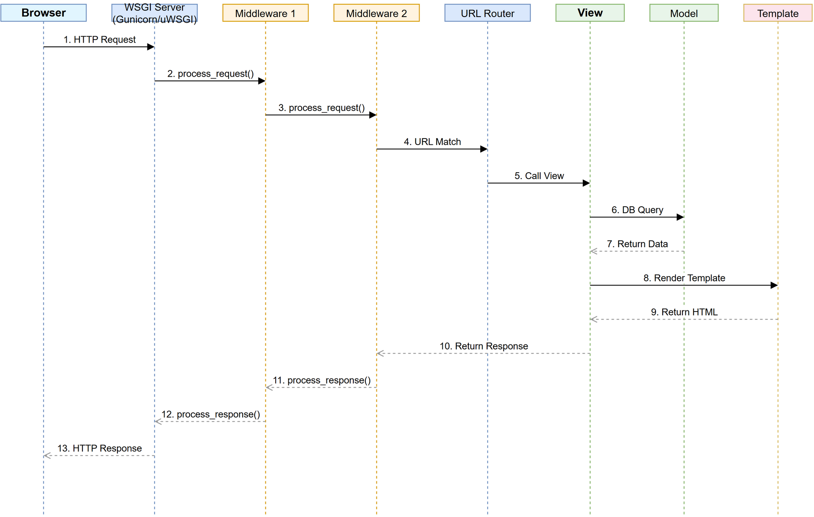
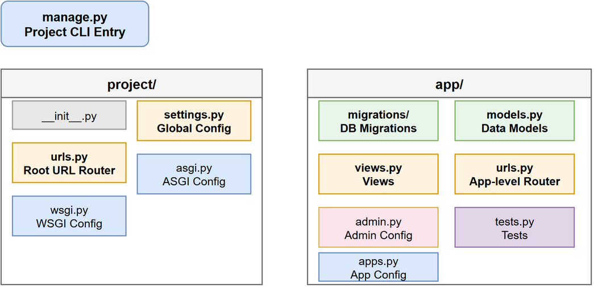

### Django 的 MTV 架构是什么？和 MVC 有什么区别？

**MVC 模式**（Model-View-Controller）是一种经典的软件设计模式，将应用分为三层：

* **Model**：处理数据逻辑与业务规则，如数据库操作。
* **View**：负责界面展示，接收用户输入。
* **Controller**：作为桥梁，接收用户请求、调用 Model 处理数据、选择 View 进行响应。

**MVT 模式**（Model-View-Template）是 Django 等框架使用的变体，本质上与 MVC 类似，但分工略有不同：

* **Model**：定义数据结构与数据库交互。
* **View**：接收 HTTP 请求，调用 Model 处理业务逻辑，返回响应（相当于 MVC 中的 Controller）。
* **Template**：负责呈现 HTML 内容（相当于 MVC 中的 View）。

**核心区别**：MVT 中 "View" 承担了控制器的职责，而 "Template" 专司展示；MVC 则明确将控制器独立出来处理流程控制。两者都是为了提高代码的解耦与可维护性。

### Django 的请求生命周期是怎样的？



1. 用户发起 HTTP 请求
2. WSGI 服务器（如 Gunicorn/uWSGI）接收请求
3. 经过 Django 中间件链的 `process_request`
4. URL 路由匹配到对应的视图函数
5. 视图处理业务逻辑，与 Model、Template 交互
6. 经过中间件链的 `process_response`
7. 返回 HTTP 响应给客户端

### Django 中的中间件是什么？执行顺序是怎样的？

中间件是 Django 的请求/响应处理钩子框架，用于全局修改请求或响应。

执行顺序：请求从` MIDDLEWARE[0] `到 `MIDDLEWARE[n] `依次处理，进入视图；响应则从 `MIDDLEWARE[n] `到 `MIDDLEWARE[0] `反向返回（洋葱模型）。

每个中间件可以定义的方法：

* `process_request(request)` — 请求阶段
* `process_view(request, view_func, view_args, view_kwargs)` — 视图调用前
* `process_exception(request, exception)` — 视图抛出异常时
* `process_template_response(request, response)` — 模板渲染后
* `process_response(request, response)` — 响应阶段

### Django 项目目录结构中各文件的作用？



### Q5: Django 中 `settings.py` 的常用配置有哪些？

```python
DEBUG = True                      # 调试模式
ALLOWED_HOSTS = ['*']             # 允许访问的主机
INSTALLED_APPS = [...]            # 已安装的应用
MIDDLEWARE = [...]                # 中间件列表
DATABASES = {...}                 # 数据库配置
STATIC_URL = '/static/'           # 静态文件 URL
STATIC_ROOT = BASE_DIR / 'static' # 静态文件收集目录
MEDIA_URL = '/media/'             # 媒体文件 URL
SECRET_KEY = '...'                # 密钥（生产环境务必保密）
```

### `ForeignKey` 的 `on_delete` 参数有哪些选项？

| 选项 | 说明 |
|---|---|
| `CASCADE` | 级联删除，删除主表记录时同时删除关联记录 |
| `PROTECT` | 阻止删除，抛出 `ProtectedError` |
| `SET_NULL` | 设置为 NULL（需要 `null=True`） |
| `SET_DEFAULT` | 设置为默认值（需要 `default` 参数） |
| `SET()` | 设置为指定值或函数返回值 |
| `DO_NOTHING` | 什么都不做（需自行保证数据完整性） |

### `class Meta` 在 Django Model 中的作用？

`class Meta` 定义模型的元数据，常用选项：

```python
class Book(models.Model):
    title = models.CharField(max_length=200)

    class Meta:
        db_table = 'book'              # 自定义表名
        ordering = ['-created_at']     # 默认排序
        verbose_name = '图书'           # 可读名称
        unique_together = ['title', 'author']  # 联合唯一约束
        indexes = [models.Index(fields=['title'])]  # 索引
        permissions = [("can_publish", "Can publish book")]  # 权限
```

### Django 中如何自定义用户模型？

```python
from django.contrib.auth.models import AbstractUser

class User(AbstractUser):
    phone = models.CharField(max_length=11, unique=True)
    avatar = models.ImageField(upload_to='avatars/')

# settings.py
AUTH_USER_MODEL = 'myapp.User'
```

**注意**：必须在第一次迁移前设置 `AUTH_USER_MODEL`，否则会很麻烦。

### Q9: 
