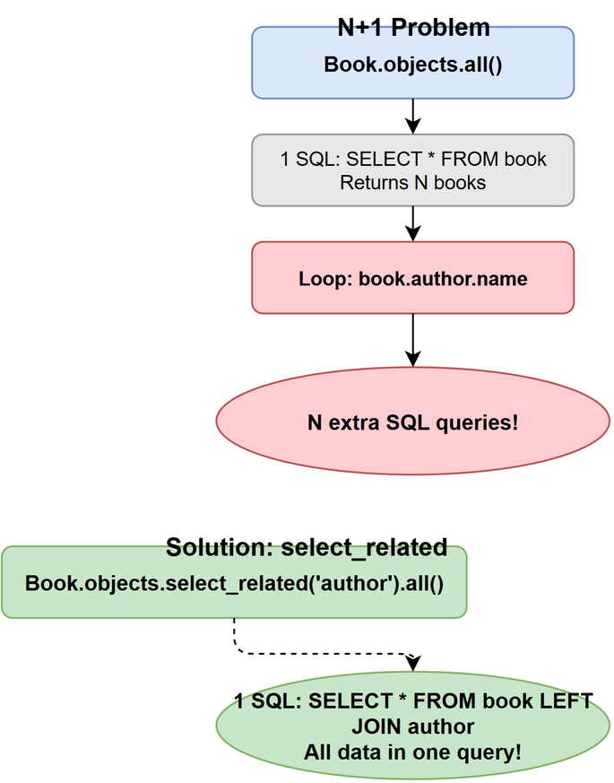

# Django ORM 数据库

>整理时间：2026-04-29 | 来源：知乎、CSDN、Stack Overflow、官方文档等

---

## 目录

1. [select_related vs prefetch_related](#q1-django-orm-中-select_related-和-prefetch_related-的区别)
2. [Q 对象和 F 对象](#q2-django-中-q-对象和-f-对象的作用)
3. [事务](#q3-django-事务怎么用)
4. [原生 SQL](#q4-django-中如何执行原生-sql)
5. [N+1 查询问题](#q5-什么是-n1-查询问题如何解决)
6. [模型继承](#q6-django-模型继承有哪几种方式)
7. [only() 和 defer()](#q7-only-和-defer-的区别)

---

### Q1: Django ORM 中 `select_related` 和 `prefetch_related` 的区别？

| | `select_related` | `prefetch_related` |
|---|---|---|
| SQL 方式 | JOIN 查询（一条 SQL） | 额外查询 + Python 拼接 |
| 适用关系 | ForeignKey / OneToOne | ManyToMany / 反向 ForeignKey |
| 性能 | 减少 SQL 次数，但 JOIN 可能很大 | 两条 SQL，Python 层关联 |



```python
# select_related：一条 SQL LEFT JOIN
books = Book.objects.select_related('author').all()

# prefetch_related：两条 SQL，Python 拼接
books = Book.objects.prefetch_related('tags').all()
```

### Q2: Django 中 `Q` 对象和 `F` 对象的作用？

**Q 对象**：构建复杂查询条件（OR、NOT）

```python
from django.db.models import Q
# 查询标题含"Django"或作者名为"张三"的书
Book.objects.filter(Q(title__icontains='Django') | Q(author__name='张三'))
# 非操作
Book.objects.filter(~Q(status='draft'))
```

**F 对象**：引用模型字段的值，避免竞争条件

```python
from django.db.models import F
# 原子更新：点赞数 +1
Article.objects.filter(id=1).update(likes=F('likes') + 1)
```

### Q3: Django 事务怎么用？

```python
from django.db import transaction

# 方式一：装饰器
@transaction.atomic
def transfer(from_account, to_account, amount):
    from_account.balance -= amount
    from_account.save()
    to_account.balance += amount
    to_account.save()

# 方式二：上下文管理器
with transaction.atomic():
    # 事务内的操作
    pass

# 方式三：手动控制（非 atomic 块内）  
# 设置保存点
sid = transaction.savepoint()
# 回滚到保存点
transaction.savepoint_rollback(sid)
```

### Q4: Django 中如何执行原生 SQL？

```python
from django.db import connection

# 查询
with connection.cursor() as cursor:
    cursor.execute("SELECT * FROM book WHERE id = %s", [book_id])
    rows = cursor.fetchall()

# 或者使用 raw()
books = Book.objects.raw('SELECT * FROM book WHERE price > %s', [100])
```

### Q5: 什么是 N+1 查询问题？如何解决？

N+1 问题：查询 N 个对象时，每个对象又触发一次额外查询。

```python
# ❌ N+1 问题
books = Book.objects.all()           # 1 条 SQL
for book in books:
    print(book.author.name)          # N 条 SQL

# ✅ 解决
books = Book.objects.select_related('author').all()  # 1 条 SQL
```

使用 `django-debug-toolbar` 或 `django-silk` 检测 N+1 问题。

### Q6: Django 模型继承有哪几种方式？

| 方式 | 说明 | DB 表 |
|---|---|---|
| 抽象基类 | `class Meta: abstract = True` | 不创建表，子类各自建表 |
| 多表继承 | 父类非抽象 | 父类和子类各一张表，OneToOne 关联 |
| 代理模型 | `class Meta: proxy = True` | 不创建新表，改变行为 |

```python
# 抽象基类
class BaseModel(models.Model):
    created_at = models.DateTimeField(auto_now_add=True)
    class Meta:
        abstract = True

# 代理模型  
class PublishedBook(Book):
    class Meta:
        proxy = True
        ordering = ['-published_at']
```

### Q7: `only()` 和 `defer()` 的区别？

* `only()`：只加载指定字段
* `defer()`：延迟加载指定字段（其他字段立即加载）

```python
# 只查询 title 和 author_id
Book.objects.only('title', 'author_id').all()

# 不加载 content 字段（可能是大文本）
Book.objects.defer('content').all()
```
