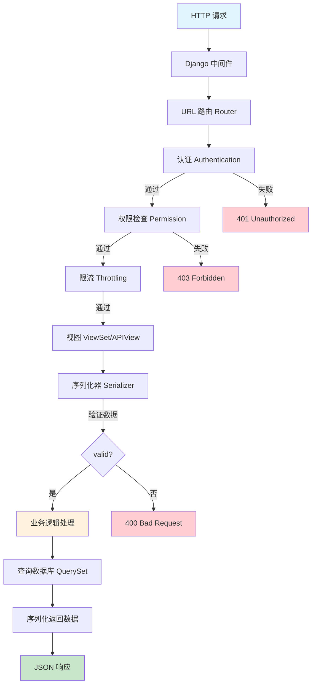

# Django REST Framework

>整理时间：2026-04-29 | 来源：知乎、CSDN、Stack Overflow、官方文档等

---

## 目录

1. [Serializer vs ModelSerializer](#q1-drf-中的序列化器和模型序列化器的区别)
2. [APIView vs ViewSet](#q2-drf-中-apiview-和-viewset-的区别)
3. [认证方式](#q3-drf-的认证方式有哪些)
4. [权限控制](#q4-drf-的权限控制怎么做)
5. [分页](#q5-drf-分页有哪几种)
6. [性能优化](#q6-drf-中如何优化性能)

---

### Q1: DRF 中的序列化器（Serializer）和模型序列化器（ModelSerializer）的区别？

**DRF 请求处理流程：**



**Serializer**：手动定义所有字段，灵活度高。

**ModelSerializer**：基于 Django Model 自动生成字段，减少样板代码。

```python
# Serializer
class BookSerializer(serializers.Serializer):
    id = serializers.IntegerField(read_only=True)
    title = serializers.CharField(max_length=200)

# ModelSerializer
class BookSerializer(serializers.ModelSerializer):
    class Meta:
        model = Book
        fields = '__all__'
        # 或
        fields = ['id', 'title', 'author']
        exclude = ['secret_field']
```

### Q2: DRF 中 APIView 和 ViewSet 的区别？

| | APIView | ViewSet |
|---|---|---|
| 路由定义 | 手动配置 URL | Router 自动生成 |
| 代码量 | 每个视图单独写 | 一套 CRUD 统一处理 |
| 灵活性 | 高 | 中等 |
| 适用 | 自定义端点 | 标准 RESTful 接口 |

```python
# APIView
class BookList(APIView):
    def get(self, request):
        ...

# ViewSet
class BookViewSet(viewsets.ModelViewSet):
    queryset = Book.objects.all()
    serializer_class = BookSerializer
```

### Q3: DRF 的认证方式有哪些？

DRF 提供的内置认证类：

* `BasicAuthentication` — HTTP 基本认证
* `TokenAuthentication` — Token 认证
* `SessionAuthentication` — Session 认证
* `JWTAuthentication`（djangorestframework-simplejwt）— JWT 认证

```python
# 全局配置
REST_FRAMEWORK = {
    'DEFAULT_AUTHENTICATION_CLASSES': [
        'rest_framework_simplejwt.authentication.JWTAuthentication',
    ],
}
```

### Q4: DRF 的权限控制怎么做？

```python
from rest_framework import permissions

# 全局配置
REST_FRAMEWORK = {
    'DEFAULT_PERMISSION_CLASSES': [
        'rest_framework.permissions.IsAuthenticated',
    ],
}

# 视图级
class BookViewSet(viewsets.ModelViewSet):
    permission_classes = [permissions.IsAuthenticatedOrReadOnly]

# 自定义权限
class IsOwnerOrReadOnly(permissions.BasePermission):
    def has_object_permission(self, request, view, obj):
        return obj.owner == request.user
```

### Q5: DRF 分页有哪几种？

| 分页类 | 说明 |
|---|---|
| `PageNumberPagination` | 基于页码，`?page=2&size=10` |
| `LimitOffsetPagination` | 基于偏移量，`?limit=10&offset=20` |
| `CursorPagination` | 基于游标，适合大数据量实时数据 |

### Q6: DRF 中如何优化性能？

* 使用 `select_related` / `prefetch_related` 减少查询
* 重写 `get_queryset` 方法添加优化
* 使用 `SerializerMethodField` 时注意 N+1
* 考虑使用 `django-restql` 或 GraphQL 减少数据量
