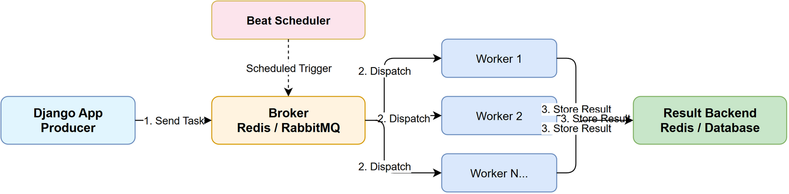

# Django Celery 异步任务

>整理时间：2026-04-29 | 来源：知乎、CSDN、Stack Overflow、官方文档等

---

## 目录

1. [核心组件](#q1-celery-的核心组件有哪些)
2. [集成 Django](#q2-django-中如何集成-celery)
3. [定义和调用任务](#q3-celery-任务如何定义和调用)
4. [定时任务](#q4-celery-定时任务怎么做)
5. [并发模型](#q5-celery-worker-的并发模型有哪些)

---

### Q1: Celery 的核心组件有哪些？

* **Producer**：产生任务的应用
* **Broker**：消息中间件（RabbitMQ / Redis）
* **Worker**：执行任务的进程
* **Result Backend**：存储任务结果（Redis / Database）



### Q2: Django 中如何集成 Celery？

```python
# celery.py
import os
from celery import Celery

os.environ.setdefault('DJANGO_SETTINGS_MODULE', 'project.settings')
app = Celery('project')
app.config_from_object('django.conf:settings', namespace='CELERY')
app.autodiscover_tasks()
```

### Q3: Celery 任务如何定义和调用？

```python
# tasks.py
from celery import shared_task

@shared_task
def send_email_task(user_id):
    user = User.objects.get(id=user_id)
    # 发送邮件逻辑
    return True

# 调用
send_email_task.delay(user_id)  # 异步
send_email_task.apply_async((user_id,), countdown=10)  # 延迟 10 秒
result = send_email_task.apply((user_id,))  # 同步（调试用）
```

### Q4: Celery 定时任务怎么做？

```python
# celery.py
from celery.schedules import crontab

app.conf.beat_schedule = {
    'clean-expired-sessions': {
        'task': 'myapp.tasks.clean_expired_sessions',
        'schedule': crontab(hour=3, minute=0),  # 每天凌晨 3 点
    },
}
```

### Q5: Celery Worker 的并发模型有哪些？

| 并发模型 | 适用场景 |
|---|---|
| `prefork`（默认） | CPU 密集型，多进程 |
| `threads` | IO 密集型（注意 GIL） |
| `eventlet/gevent` | 高 IO 并发 |
| `solo` | 调试 |

```bash
celery -A project worker --concurrency=4 --pool=gevent
```
